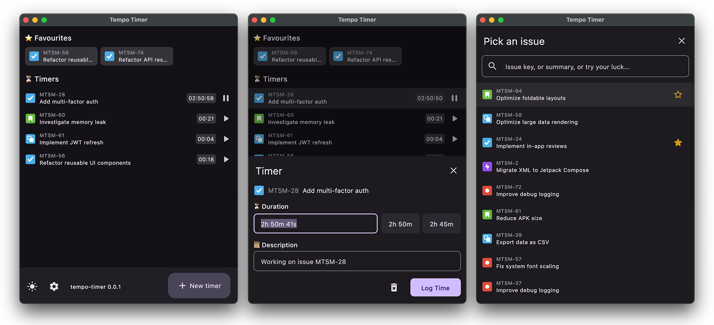

# tempo-timer

**A simple desktop client for Tempo Timesheets, built with Kotlin and Compose Multiplatform.**

**Track your time effortlessly.**

tempo-timer is a simple desktop app designed for logging time on Jira issues directly into Tempo Timesheets. It’s perfect for users who prefer real-time tracking (like me!) and find existing web UI and/or browser extension very slow or clunky (also, like me!). Currently, tracking is limited to "today"—for other dates, use the Tempo web interface.

The app is tested on macOS. It supports Jira Cloud only.

## Features
- ⏱ **Track time** directly in Tempo Timesheets
- ✍ **Edit worklogs** before submitting (time & description)
- 🔍 **Search Jira issues** quickly
- ⭐ **Save favorite issues** for fast access
- 🎛 **Manage multiple timers** simultaneously
- 🌙 **Dark mode support**

Interested in Kotlin Multiplatform? Learn more [here](https://www.jetbrains.com/help/kotlin-multiplatform-dev/get-started.html).

## Download

Download latest release [here](https://github.com/matejsemancik/tempo-timer/releases/latest).
The app is not signed on macOS, yet (TBD). Considering you inspected source code and you trust the app, you can manually do `xattr -d -r com.apple.quarantine <path_to_Tempo Timer.app>`, or navigate to System Security settings and allow it to open there.

## Getting started

1. Create a Jira API token → [Generate here](https://id.atlassian.com/manage-profile/security/api-tokens)
2. Create a Tempo API token → Follow [these steps](https://apidocs.tempo.io/#section/Authentication) (Using the REST API as an individual user). Token must have permissions to access Worklogs.
3. Log in: Open the app -> Settings and enter your Jira cloud instance name, Jira account email, and both tokens.

That’s it!

## Development

- To build package locally, run `./gradlew packageDistributionForCurrentOS`
- Run with `./gradlew runDistributable`
