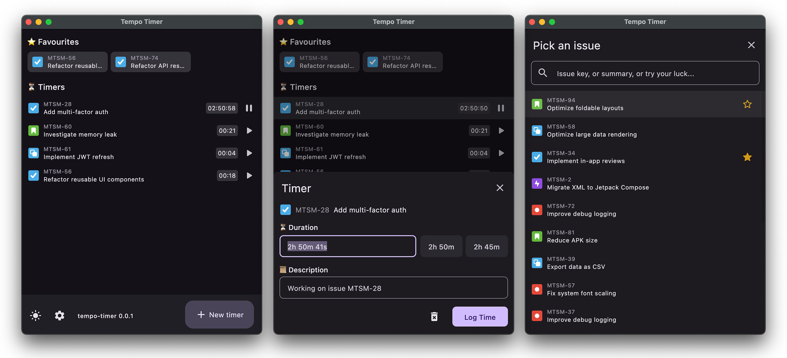

# tempo-timer

**Minimalistic desktop client for Tempo Timesheets written in Kotlin and Compose Multiplatform.**

This project aims to provide a simple desktop app for tracking time spent on Jira issues into Tempo. It is intended mainly for users who like to track time in real-time (e.g. me). Tracking for dates other than "today" is not supported (yet) and can be done from Tempo web interface.

The app runs in system tray and was tested only on macOS. Works with Jira cloud only.

**Features:**
- Track time into Tempo Timesheets
- Adjust time and description of Worklog before sending to Tempo
- Search Jira issues
- Save your favourite issues for fast access
- Manage multiple timers simultaneously
- Dark mode

Learn more about [Kotlin Multiplatform](https://www.jetbrains.com/help/kotlin-multiplatform-dev/get-started.html)

## How to use

1. Create a Jira API token at https://id.atlassian.com/manage-profile/security/api-tokens
2. Create a Tempo API token with steps described here https://apidocs.tempo.io/#section/Authentication
3. Open app settings and log in using your Jira cloud instance name, jira account e-mail and tokens obtained in steps above.
